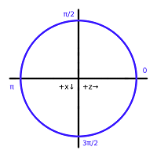

This page presents a dissection of the current stable [Minecraft](http://minecraft.net/game/) protocol. The current pre-release protocol is documented [elsewhere](Pre-release_protocol.md). The protocol for Pocket Minecraft is substantially different, and is documented at [Pocket Minecraft Protocol](Pocket_Minecraft_Protocol).

If you're having trouble, check out the [FAQ](Protocol_FAQ) or ask for help in the IRC channel ([#mcdevs on irc.freenode.net](irc://irc.freenode.net/mcdevs)).

**Note**: While you may use the contents of this page without restriction to create servers, clients, bots, etc… you still need to provide attribution to #mcdevs if you copy any of the contents of this page for publication elsewhere.

                                     | Definition                               
 ----------------------------------- | --------------------------------------------------------------------------------------
 Player                              | When used in the singular, Player always refers to the client connected to the server
 Entity                              | Entity refers to any item, player, mob, minecart or boat in the world. This definition is subject to change as Notch extends the protocol
 EID                                 | An EID - or Entity ID - is a unique 4-byte integer used to identify a specific entity 
 XYZ                                 | In this document, the axis names are the same as those used by Notch. Y points upwards, X points South, and Z points West.

Packets
========

All packets begin with a single "Packet ID" byte. Listed packet size includes this byte. Packets are either "server to client", "client to server", or "Two-Way" (both). Packets are not prefixed with their length. For variable length packets, you must parse it completely to determine its length.

Keep Alive (0x00)
-----------------
*Two-Way*

The server will frequently send out a keep-alive, each containing a random ID. The client must respond with the same packet. The Beta server will disconnect a client if it doesn't receive at least one packet before 1200 in-game ticks, and the Beta client will time out the connection under the same conditions. The client may send packets with Keep-alive ID=0.

Packet ID   | Field Name    | Field Type | Example   | Notes
------------|---------------|------------|-----------|----------------------------
0x00        | Keep-alive ID | int        | 957759560 | Server-generated random id 
Total Size: | 5 bytes

Login Request (0x01)
--------------------
*Server to Client*

See [Protocol Encryption](Protocol_Encryption) for information on logging in.

Packet ID   | Field Name    | Field Type | Example   | Notes
------------|---------------|------------|-----------|----------------------------
0x01        | Entity ID     | int        | 957759560 | Server-generated random id 
            | Level type    | string     | default   | default, flat, or largeBiomes. level-type in server.properties
			| Game mode     | byte       | 0         | 0: survival, 1: creative, 2: adventure. Bit 3 (0x8) is the hardcore flag
			| Dimension     | byte       | 0         | -1: nether, 0: overworld, 1: end 
			| Difficulty    | byte       | 1         | 0 thru 3 for Peaceful, Easy, Normal, Hard  
			| Not used      | byte       | 0         | Only 0 observed from vanilla server, was previously world height 
			| Max players   | byte       | 8         | Used by the client to draw the player list 
Total Size: | 12 bytes + length of strings

Handshake (0x02)
----------------
*Client to server*

See [Protocol Encryption](Protocol_Encryption) for information on logging in.

Packet ID   | Field Name       | Field Type | Example   | Notes
------------|------------------|------------|-----------|----------------------------
0x02        | Protocol Version | byte       | 51        | As of 1.5.2 the protocol version is 61. See [Protocol version numbers](Protocol_version_numbers) for list. 
            | Username         | string     |  _AlexM   | The username of the player attempting to connect 
			| Server Host      | string     | localhost | 
			| Server Port      | int        | 25565     | 
Total Size: | 10 bytes + length of strings

Chat Message (0x03)
----------------
*Two-Way*

The default server will check the message to see if it begins with a '/'. If it doesn't, the username of the sender is prepended and sent to all other clients (including the original sender). If it does, the server assumes it to be a command and attempts to process it. A message longer than 100 characters will cause the server to kick the client. (As of 1.3.2, the vanilla client appears to limit the text a user can enter to 100 charaters.) This limits the chat message packet length to 203 bytes (as characters are encoded on 2 bytes). Note that this limit does not apply to chat messages sent by the server, which are limited to 32767 characters since 1.2.5. This change was initially done by allowing the client to not slice the message up to 119 (the previous limit), without changes to the server. For this reason, the vanilla server kept the code to cut messages at 119, but this isn't a protocol limitation and can be ignored. 

For more information, see [Chat](Chat). 

Packet ID   | Field Name | Field Type | Example            | Notes
------------|------------|------------|--------------------|----------------------------
0x03        | Message    | string     | <Bob> Hello World! | User input must be sanitized server-side
Total Size: | 10 bytes + length of strings

Time Update (0x04)
----------------
*Server to Client*

Time is based on ticks, where 20 ticks happen every second. There are 24000 ticks in a day, making Minecraft days exactly 20 minutes long. 

The time of day is based on the timestamp modulo 24000. 0 is sunrise, 6000 is noon, 12000 is sunset, and 18000 is midnight. 

The default SMP server increments the time by 20 every second. 

Packet ID   | Field Name       | Field Type | Example  | Notes
------------|------------------|------------|----------|----------------------------
0x04        | Age of the world | long       | 45464654 | In ticks; not changed by server commands
            | Time of Day      | long       | 21321    | The world (or region) time, in ticks
Total Size: | 17 Bytes

Entity Equipment (0x05)
----------------
*Server to Client*

Packet ID   | Field Name | Field Type        | Example    | Notes
------------|------------|-------------------|------------|----------------------------
0x04        | Entity ID  | int               | 0x00010643 | Named Entity ID 
            | Slot       | short             | 4          | Equipment slot: 0=held, 1-4=armor slot (1 - boots, 2 - leggings, 3 - chestplate, 4 - helmet) 
            | Item       | [slot](Slot_Data) |            | Item in slot format
Total Size: | 7 bytes + slot data

Spawn Position (0x06)
----------------
*Server to Client*

Sent by the server after login to specify the coordinates of the spawn point (the point at which players spawn at, and which the compass points to). It can be sent at any time to update the point compasses point at. 

Packet ID   | Field Name | Field Type | Example | Notes
------------|------------|------------|---------|----------------------------
0x06        | X          | int        | 117     | Spawn X in block coordinates
            | Y          | int        | 70      | Spawn Y in block coordinates
            | Z          | int        | -46     | Spawn Z in block coordinates
Total Size: | 13 bytes

Use Entity (0x07)
----------------
*Client to Server*

This packet is sent from the client to the server when the client attacks or right-clicks another entity (a player, minecart, etc). 

A Notchian server only accepts this packet if the entity being attacked/used is visible without obstruction and within a 4-unit radius of the player's position. 

Packet ID   | Field Name   | Field Type | Example | Notes
------------|--------------|------------|---------|----------------------------
0x07        | User         | int        | 1298    | The entity of the player (ignored by the server) 
            | Target       | int        | 1805    | The entity the player is interacting with 
            | Mouse button | boolean    | -true   | true when the player is left-clicking and false when right-clicking.
Total Size: | 10 bytes

Update Health (0x08)
----------------
*Server to Client*

Sent by the server to update/set the health of the player it is sent to. Added in protocol version 5. 

Food saturation acts as a food "overcharge". Food values will not decrease while the saturation is over zero. Players logging in automatically get a saturation of 5.0. Eating food increases the saturation as well as the food bar. 

Packet ID   | Field Name      | Field Type | Example | Notes
------------|-----------------|------------|---------|----------------------------
0x08        | Health          | short      | 20      | 0 or less = dead, 20 = full HP
            | Food            | short      | 20      | 0 - 20
            | Food Saturation | float      | 5.0     | Seems to vary from 0.0 to 5.0 in integer increments
Total Size: | 9 bytes

Respawn (0x09)
----------------
*Server to Client*

To change the player's dimension (overworld/nether/end), send them a respawn packet with the appropriate dimension, followed by prechunks/chunks for the new dimension, and finally a position and look packet. You do not need to unload chunks, the client will do it automatically. 

Packet ID   | Field Name      | Field Type | Example | Notes
------------|-----------------|------------|---------|----------------------------
0x09        | Dimension       | int        | 1       | -1: The Nether, 0: The Overworld, 1: The End
            | Difficulty      | byte       | 1       | 0 thru 3 for Peaceful, Easy, Normal, Hard. 1 is always sent c->s
            | Game mode       | byte       | 1       | 0: survival, 1: creative, 2: adventure. The hardcore flag is not included
            | World type      | short      | 256     | Defaults to 256 
            | Level type      | string     | default | See [0x01 login](Protocol#login-request-0x01)
Total Size: | 11 bytes + length of string 

Player (0x0A)
----------------
*Client to Server*

This packet is used to indicate whether the player is on ground (walking/swimming), or airborne (jumping/falling). 

When dropping from sufficient height, fall damage is applied when this state goes from False to True. The amount of damage applied is based on the point where it last changed from True to False. Note that there are several movement related packets containing this state. 

This packet was previously referred to as Flying 

Packet ID   | Field Name | Field Type | Example | Notes
------------|------------|------------|---------|----------------------------
0x0A        | On Ground  | boolean    | 1       | True if the client is on the ground, False otherwise 
Total Size: | 2 bytes

Player Position (0x0B)
----------------
*Client to Server*

Updates the players XYZ position on the server. If Stance - Y is less than 0.1 or greater than 1.65, the stance is illegal and the client will be kicked with the message “Illegal Stance”. If the distance between the last known position of the player on the server and the new position set by this packet is greater than 100 units will result in the client being kicked for "You moved too quickly :( (Hacking?)" Also if the absolute number of X or Z is set greater than 3.2E7D the client will be kicked for "Illegal position" 

Packet ID   | Field Name | Field Type | Example | Notes
------------|------------|------------|---------|----------------------------
0x0B        | X          | double     | 102.809 | Absolute position 
            | Y          | double     | 70.00   | Absolute position 
            | Stance     | double     | 71.62   | Used to modify the players bounding box when going up stairs, crouching, etc…
            | Z          | double     | 68.30   | Absolute position
            | On Ground  | boolean    | 1       | Derived from packet [0x0A](Protocol#player-0x0A)
Total Size: | 34 bytes

Player Look (0x0C)
----------------
*Client to Server*

Updates the direction the player is looking in. 

Yaw is measured in degrees, and does not follow classical trigonometry rules. The unit circle of yaw on the xz-plane starts at (0, 1) and turns backwards towards (-1, 0), or in other words, it turns clockwise instead of counterclockwise. Additionally, yaw is not clamped to between 0 and 360 degrees; any number is valid, including negative numbers and numbers greater than 360. 

Pitch is measured in degrees, where 0 is looking straight ahead, -90 is looking straight up, and 90 is looking straight down. 

You can get a unit vector from a given yaw/pitch via: 

	x = -cos(pitch) * sin(yaw)
	y = -sin(pitch)
	z =  cos(pitch) * cos(yaw)

Packet ID   | Field Name | Field Type | Example | Notes
------------|------------|------------|---------|----------------------------
0x0C        | Yaw        | double     | 0.00    | Absolute rotation on the X Axis, in degrees
            | Pitch      | double     | 0x00    | Absolute rotation on the Y Axis, in degrees  
            | On Ground  | boolean    | 1       | Derived from packet [0x0A](Protocol#player-0x0A)
Total Size: | 10 bytes

